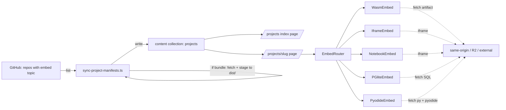

import { Image } from 'astro:assets'

A personal site that lists projects is fine. A personal site where you can
**actually use the projects** — type input into a compiler, query a
database in the browser, play against an old game-playing agent, watch a
graph algorithm animate while you click vertices — is a different thing.
It crosses the line between portfolio and product.

This is how I'm building that. The architecture is generic — none of it
is specific to my projects, none of it is specific to college work. Any
working project, in any language, by anyone with a personal site, can
fit through this pipe.

## The framing

You have a pile of working projects. They live in their own repos. They
were written in different languages, different years, for different
purposes. A few of them have web UIs already. Most don't.

The naive way to put live versions on your personal site is:

- Add each project as a git submodule.
- Build everything in the site's CI.
- Bundle it all into one deploy.

This is a trap. It tightly couples the cadence of your site deploys to
the cadence of every project you've ever embedded. It makes private
projects auth-painful in CI. The site bundle blows past Cloudflare's
free Worker limit (10 MB compressed) within five or six WebAssembly
modules. And the friction of "add a project" becomes high enough that
you stop adding projects.

The architecture below avoids all of that. It splits the work cleanly:

- **Each project owns its own build.** It compiles itself to a
  web-deployable artifact and publishes that artifact to a stable URL.
- **The personal site owns discovery and rendering.** It enumerates
  repos by GitHub topic, fetches a manifest from each, validates the
  manifest, and renders one page per project. Pages mount a small embed
  component that loads the artifact at the URL the manifest declared.

There are no submodules. The personal site never imports project source.
Adding a new project to the site is a self-service action that lives
entirely inside the project's own repo.

## The contract

Every embeddable project repo has one file at the repo root:

```json
{
  "schemaVersion": 1,
  "slug": "my-project",
  "category": { "kind": "side", "year": 2025 },
  "title": "My project",
  "description": "What it does in one sentence.",
  "tags": ["wasm", "graphics"],
  "completionLevel": "works",

  "embed": {
    "kind": "wasm-emscripten",
    "entry": "main.js"
  },

  "delivery": {
    "mode": "runtime-r2",
    "url": "https://assets.your-domain/my-project/abc1234/",
    "version": "abc1234",
    "sizeBytes": 412800
  },

  "build": {
    "ci": true
  }
}
```

That's the whole interface between a project and the personal site. The
manifest declares:

- A globally-unique URL slug.
- Some metadata for the card and listing pages.
- An `embed.kind` that tells the site **how** to render the project.
- A `delivery` block that tells the site **when** to acquire the
  artifact and **where** it's served from.

The site's renderer is a discriminated union on `embed.kind`. There's a
React component per kind. The component takes one prop — the URL of the
artifact — and knows how to mount it. That's all.

## The kinds

I started by listing every project I might want to embed and asking
"what does it take to run this in a browser tab?" Eight categories cover
essentially everything I've ever built, and probably everything you've
ever built too:

```
static-html        →  it's already a web app, just iframe it
wasm-emscripten    →  C/C++ via emcc, mounted via <script>
wasm-rust          →  Rust via wasm-pack, mounted via <script>
pyodide            →  Python in the browser via Pyodide
notebook-html      →  Jupyter rendered to HTML, iframed
pglite-db          →  Postgres in WASM via PGlite, schema preloaded
tex-pdf            →  LaTeX writeup rendered to PDF, viewed via PDF.js
external-app       →  needs a real server; iframe a deployed URL
```

The first three handle anything that runs in the browser without a
runtime: native code, Rust, plain web apps. `pyodide` handles the
narrower band of Python projects light enough to run client-side — game
agents, simulators, classical-ML scoring functions. `notebook-html`
handles every "I have a Jupyter notebook" deliverable as a read-only
view. `pglite-db` handles database projects: a recent ElectricSQL
release ships a full Postgres compiled to WASM, including PostGIS, that
runs entirely in the browser tab. You bundle a `schema.sql` and an
optional `seed.sql`, and you give the visitor a working query editor
without ever shipping a server.

`tex-pdf` is the lazy-but-honest path for LaTeX-only projects: a proof
or paper isn't interactive in any meaningful sense, but rendering it
inline as a PDF beside everything else lets you treat theory work as a
first-class portfolio entry instead of an afterthought.

`external-app` is the escape hatch. Some projects need a real server: a
big ML model, a real database, anything stateful across users. The
project deploys itself to whatever runtime makes sense — Fly, Railway,
Modal, your own infra — and the manifest's URL points at the deployed
app. The site iframes it.

Adding a ninth kind is a 30-line PR: extend the discriminated union,
write a renderer component, register it.

## Three ways to deliver an artifact

The first cut of this architecture had only one delivery path — push to
GitHub Pages, fetch at view time. That was a mistake. Hosting and
acquisition timing are two independent decisions, and hardcoding them
together rules out cases where a different combination is obviously
better. The cleaner model has three modes, picked per project:

| Mode | Acquired | Served from | Best for |
|---|---|---|---|
| `bundle` | site CI at build time | same origin (`your-site.com/projects/<slug>/`) | small artifacts, fully-offline pages |
| `runtime-r2` ⭐ | visitor at view time | object storage on a subdomain you control | almost everything |
| `runtime-foreign` | visitor at view time | wherever the project hosts itself | projects that already have a live deployment |

**Bundle mode** is the simplest case. The site's prebuild step fetches
each bundle-mode project's artifact once, copies it into the site's own
`dist/projects/<slug>/`, and rewrites the manifest's URL to a same-origin
path. The artifact ships with the page — no runtime fetch, no CORS,
trivially cacheable, and it works even if every external host is down.
The cost is that the artifact counts against your site's static-asset
quota; on Cloudflare Workers, you want individual bundles under about a
megabyte before this becomes a problem.

**Runtime-r2 mode** is the default I'd reach for. Object storage on a
subdomain of the site's apex (`assets.your-domain`) gets you a single,
clean origin for every project's artifacts, free egress on Cloudflare
R2, versioned URL paths (`<slug>/<git-sha>/`), and zero per-project
hosting setup. The project's CI uploads to R2 via the S3-compatible API
using credentials you store as **GitHub organization secrets** so any
project can use them without per-repo config. Atomic rollback is a
one-line manifest edit pointing at a previous SHA.

**Runtime-foreign mode** is the escape hatch. Some projects already have
a live deployment — a Worker, a Fly app, a long-standing GitHub Pages
site you set up years ago. There's no point in mirroring that into your
asset bucket; the manifest just points at the existing URL. Pair this
mode with the `external-app` embed kind for anything that needs a real
server, or with `static-html` for an existing static deployment.

The renderer components don't know or care which mode is in play. They
take a URL prop and load from it. The mode is a delivery concern, not a
rendering concern.

> **Why object storage over per-repo GitHub Pages?** Pages is tempting
> because it's free and zero-setup, but it splits artifact hosting across
> `*.github.io` URLs you don't control, has no per-version path
> convention, and adds a third-party origin to the trust boundary. R2
> with a custom subdomain on the same eTLD+1 as the site is cleaner
> end-to-end, gives you free egress, and lets you put one CORS rule on
> one bucket instead of N. Pages still has its place — it's the right
> answer for `runtime-foreign` when a project already deploys there.

## Setting up the asset bucket once

Whichever object store you pick (R2, S3, B2, anything S3-compatible),
the setup is one-time and shared across every project:

1. Create a bucket. One.
2. Attach a custom domain (`assets.your-domain`).
3. Add a CORS rule whitelisting your site's domains and `localhost`.
4. Generate a scoped API token, save the credentials as **organization
   secrets** in GitHub so any project repo can use them.
5. Test once with a hello-world upload. Confirm CORS, confirm the URL
   shape.

Then every project's CI is a 10-line caller that invokes a reusable
upload step. The bucket convention is `<slug>/<git-sha>/`, never
`<slug>/` directly — versioned paths make rollback a single-line
manifest edit, and they make concurrent pushes from the same project
race-free.

## The discovery flow

The discovery code is a single TypeScript file in the personal site's
prebuild step:

```ts
// roughly
const repos = await listReposWithTopic('your-embed-topic')
for (const repo of repos) {
  const manifest = await fetchRawJSON(repo, 'web.codeseys.json')
  const parsed = ProjectManifest.safeParse(manifest)
  if (!parsed.success) {
    log('skipping', repo, parsed.error)
    continue
  }

  if (parsed.data.delivery.mode === 'bundle') {
    await fetchAndStage(parsed.data.delivery.url, `dist/projects/${parsed.data.slug}/`)
    parsed.data.delivery.url = `/projects/${parsed.data.slug}/`  // rewrite to same-origin
  }

  await writeContentEntry(parsed.data)
}
```

The personal site lists repos by GitHub topic, fetches each manifest
from `raw.githubusercontent.com`, validates with zod, optionally
copies bundle-mode artifacts into the site's own `dist/`, and writes one
JSON file per project into `src/content/projects/`. From there, the
content collection takes over: the listing page renders cards, and the
slug page renders a single project with its embed.

A failed manifest never breaks the build. If your project's JSON has a
typo, the site still deploys; that one project just doesn't appear
until the next push. This matters: you do not want a typo in a side
project to take down your blog.



## Private projects, public artifacts

Some of your projects can't be public — internship code, a course where
the instructor prohibits publishing solutions, anything still under
embargo. The architecture handles this cleanly because **the personal
site only needs the artifact to be reachable, not the source.**

The clean path: the private repo's CI uses the same shared org-secret
credentials to upload its built artifact to the asset bucket. The
bucket is public; the source repo stays private. The personal site
fetches from the bucket without ever needing GitHub auth. Visitors can
use the project but can't read the code.

This is the legally safest path for coursework too. A visitor can play
with a homework-derived calculator but can't fork its source and submit
it as their own.

## Reusable CI

Each `embed.kind` has the same build pipeline every time. C++ to WASM
is always the same emcc invocation. Notebook to HTML is always the same
nbconvert. Rust to WASM is always the same wasm-pack. Each pipeline ends
with the same R2 upload step. So those pipelines live as **reusable
workflows** in a shared repo, and each project's CI is a 10-line caller:

```yaml
name: build web embed
on:
  push: { branches: [main] }
  workflow_dispatch:
jobs:
  build:
    uses: my-org/web-embed-workflows/.github/workflows/wasm-emscripten.yml@main
    with:
      manifest: web.codeseys.json
    secrets: inherit  # picks up the R2_* org secrets
```

Five reusable workflows cover all eight kinds (a couple share a
workflow). Adding a new project means picking the right workflow,
filling in inputs, done.

## What the personal site has to ship once

To support all of this, the personal site needs:

- A zod schema for the manifest (one file).
- A discovery script that runs in prebuild (one file).
- A content collection definition for projects (a few lines).
- A listing page at `/projects` (one Astro page).
- A slug page at `/projects/[slug]` (one Astro page).
- An `<EmbedRouter>` component that switches on `kind` (one file).
- One renderer component per kind, each small (~50 lines for the
  iframe-based ones, ~100 lines for the WASM and PGlite ones).
- A scheduled garbage-collection job that prunes unreferenced
  R2 objects older than some retention window.

All in, you're looking at well under a thousand lines of site code. The
heavy lifting is delegated to the projects. That's the point: the site
is a **directory and renderer**, not a build system.

The site code is also language- and framework-agnostic in spirit. I run
this on Astro + Cloudflare Workers because that's what the site
already is, but the same architecture works on Next.js, on a static
site, on anything that can fetch JSON at build time and ship a few
React components.

## What it costs to add a new project

Once the architecture is in place, the marginal cost of making a new
project interactable on your site is:

1. Pick the embed kind (5 minutes).
2. Pick the delivery mode (5 seconds — it's almost always `runtime-r2`).
3. Author the manifest (10 minutes).
4. Add a CI workflow that calls the right reusable workflow (5 minutes).
5. Verify the artifact at the public URL (a CI run).
6. Add the discovery topic to the repo (one click).

Twenty minutes plus CI time. No personal-site PR. No coordination. The
next time the site rebuilds, your project is there.

## Why this matters

The reason most personal sites stay at "list of projects with a link to
GitHub" is that going one step further is high-friction every time.
"Just put it on the site" rounds up to a day of work per project, and
that day fights for time with whatever you actually want to build.

The architecture above is a one-time investment that **changes the
gradient**. Embedding a project is now lower-friction than writing the
README. So you do it. So your site has live, runnable versions of
everything you've ever shipped. So a recruiter or a friend or a
random visitor doesn't have to take your word that the thing works —
they can use it, in their tab, right now.

That's the threshold worth aiming for: a portfolio that **proves
itself**.

## Caveats

A few things worth saying out loud:

- WebAssembly memory limits are real. A model that needs 4 GB of RAM
  isn't going to run in `wasm32`. That's what `external-app` is for.
- Pyodide's startup is slow (a couple of seconds) and the wheel
  ecosystem isn't as broad as native Python. Use it for clean
  Python-only code; don't try to embed projects that depend on Cython
  extensions or GPU libraries.
- Notebook-as-HTML is **read-only**. If interactivity is critical to
  the project, you need to push the logic into one of the other kinds.
- Cloudflare Workers' bundle limit is genuinely tight on the free
  plan. Keep the site itself lean — runtime-mode embeds load *external*
  artifacts at view time and only the small renderer components live in
  the bundle. Bundle-mode artifacts go into the site's static-asset
  quota, so reserve that mode for genuinely small payloads.
- Slugs are forever. Once a project has a public slug, breaking that
  URL breaks anyone who linked to it. Add aliases instead of renaming.
- Don't open the asset bucket's CORS rule to `*`. Whitelist your site's
  domains and `localhost`. The bucket exists to feed your embeds, not
  to be a free CDN for the public internet.

## What's next

In a follow-up post I'll walk through the first project I shipped on
this pipeline end-to-end — the manifest, the workflow, the WASM glue,
the embed renderer, the R2 upload — so the architecture stops being
theoretical and starts being a worked example. The code's already there
waiting; the post is the easy part.

If you want to do this on your own site, the whole thing is small enough
that an afternoon gets you the schema, the discovery script, and the
first two embed kinds. The remaining kinds are a steady weekly drip
after that, as you find projects you actually want to embed.

The site stops being a list of links. It starts being a place where
work lives.
