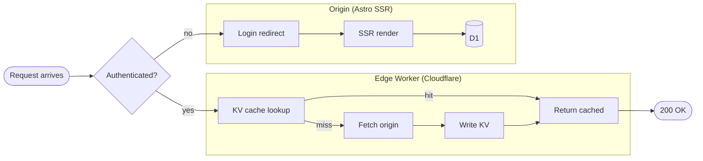
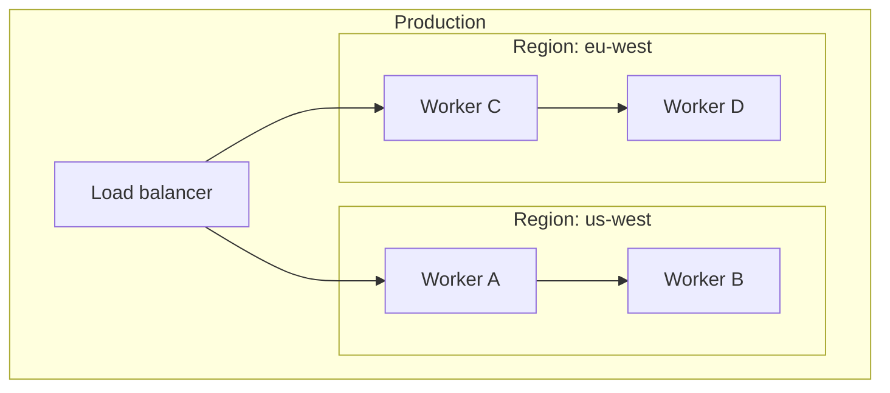
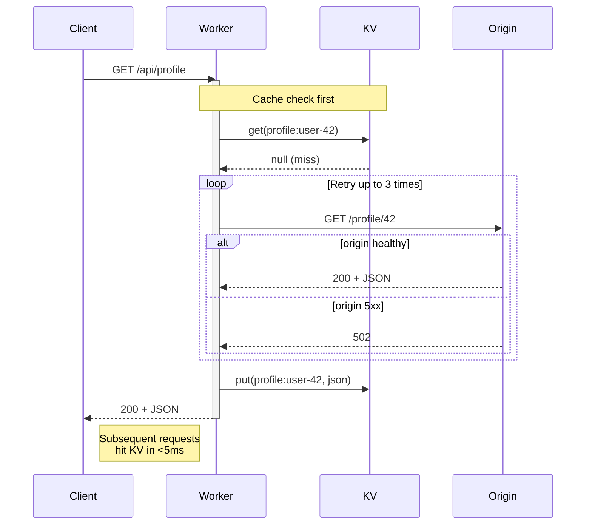
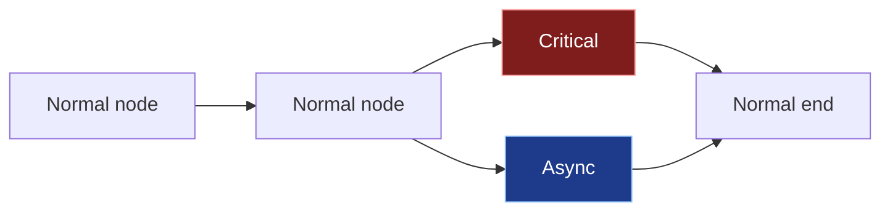
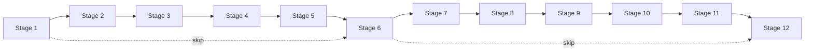
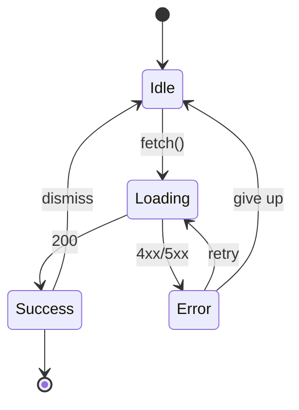

A live reference of every Mermaid diagram type this blog supports.
Each block below is rendered through the same build-time pipeline as
every other diagram on the site: `rehype-mermaid` + Playwright at SSR,
mermaid's embedded `<style>` stripped, the site's class-scoped CSS
owning the theme. They all swap palettes when you toggle dark/light.

If you're curious how that theming actually works (and why it took
five PRs to land), the long-form story is in
[*Theming Mermaid diagrams properly*](/blog/mermaid-theme-debug-arc).
This page is the evergreen "what does it look like / how do I write
one" companion.

## Flowchart with two subgraphs

Standard subgraph layout. Cluster backgrounds get a subtle muted tint
so they read as a grouped region without dominating; cluster titles
sit in the page's foreground color.

Node-shape coverage in this one diagram alone: stadium (`([Foo])`),
diamond (`{Foo?}`), rectangle (`[Foo]`), database cylinder (`[(Foo)]`).
All themed.

## Nested subgraphs

Subgraph-inside-subgraph. The two layers of the muted tint stack
visibly — each adds a small step of contrast against the page
background — so structure stays readable without explicit borders.

## Sequence diagram with notes, loops, and alt blocks

A different element family: actor boxes, lifelines, message arrows,
dashed return arrows, alt blocks, loop blocks, notes, and activation
rectangles.

Mermaid normally bakes notes and activation bars in a hardcoded yellow
that clashes against dark mode. The site CSS reroutes them to the
theme's accent and primary colors.

## `classDef` for per-node tinting

When the default theme isn't enough — say you want to mark one node
as "critical" red and another as "async" blue — `classDef` lets you
declare per-node colors that pass through the theme untouched.

Mermaid emits `classDef` styles as inline `style="..."` attributes on
the rendered nodes. Inline styles beat the site's class-scoped theme,
so your custom colors win — exactly what you want.

## Wide flowchart (overflow scroll)

Diagrams wider than the prose column horizontal-scroll inside their
frame, with a sticky right-edge fade as a discoverability cue. Edge
labels stay readable as they pass under the gradient.

Click the expand button at the top of any diagram to open a fullscreen
modal where you can pan and zoom — useful for dense diagrams like this
one.

## State diagram

State diagrams use a different code path internally — transitions are
emitted as `<path class="transition">`, not `.flowchart-link` — but
from the author's side it's the same fenced block.

Start and end markers (`[*]`) render as small filled and ringed
circles respectively.

---

If a diagram type you want to use isn't represented here and you find
something rendering oddly — washed-out fills in light mode, white
blocks in dark, missing strokes — open an issue on [the
repo](https://github.com/baladithyab/baladithyab.github.io). The
theme covers the common types but the SVG element zoo mermaid emits
is large enough that there are probably edge cases I haven't hit yet.
