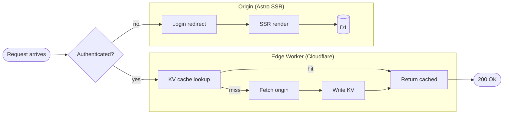
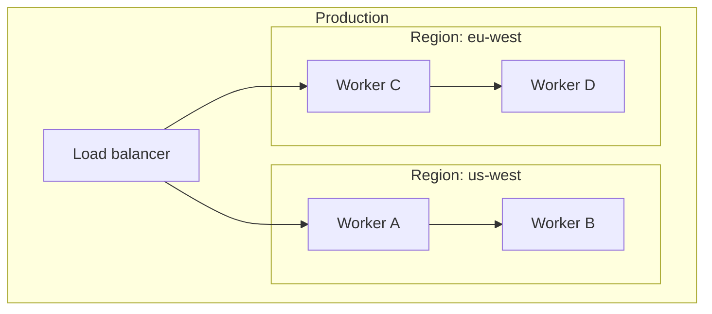
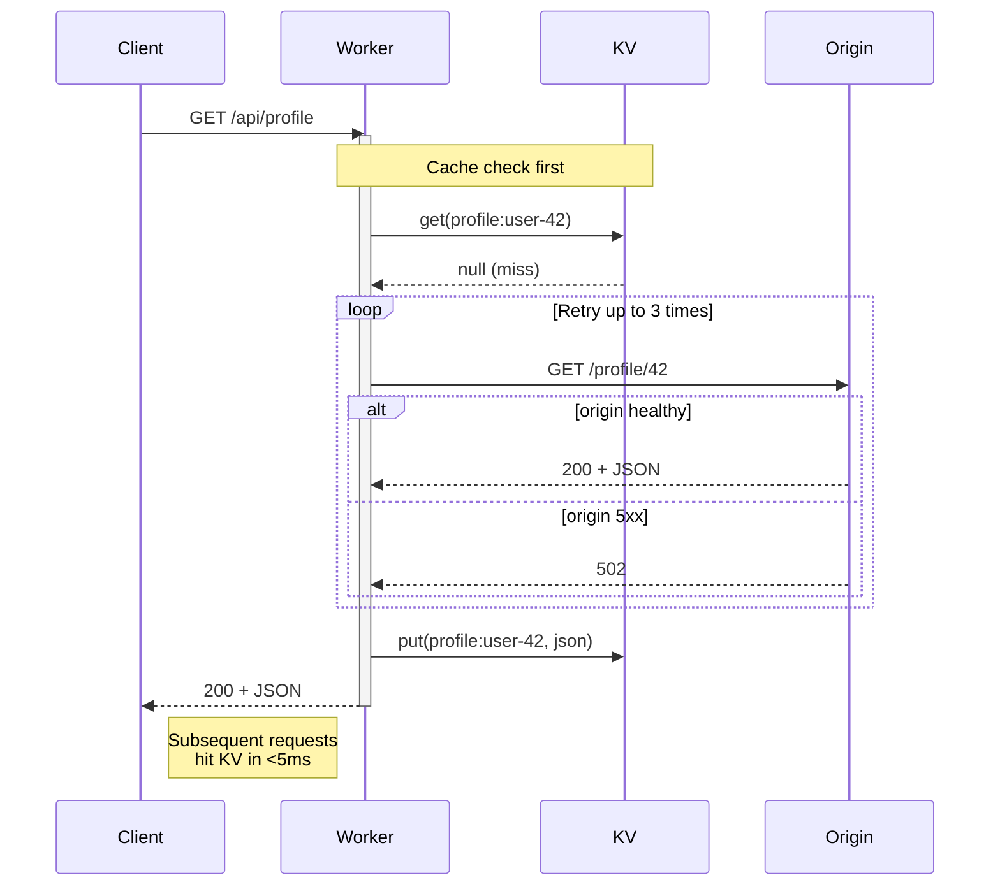
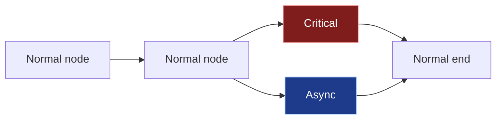
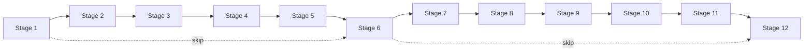
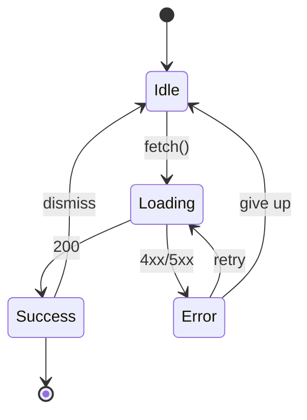

Five days ago I [shipped Mermaid rendering on this blog](/blog/visualizations-now-render-mermaid-and-images-on-the-blog).
That post claimed:

> *Diagrams use Mermaid's `neutral` theme so they read cleanly on both
> light and dark backgrounds. (We can't follow the manual theme toggle
> without client-side rendering, so we picked a neutral look that
> doesn't need to.)*

That was wrong on both halves. The neutral theme didn't read cleanly on
dark backgrounds — it dropped white rectangles on top of every edge
label. And it turns out **you absolutely can** follow a manual theme
toggle without client-side rendering. You just have to win a fight with
CSS specificity that you didn't know you were in.

This post is a real-time debug arc through five PRs, ending in a fix
that lets ordinary class-scoped CSS own every diagram on the site. The
final theme survives a stress test of 6 different diagram types and
two color modes — gallery at the bottom.

## The bug in one screenshot

Dark mode, expanded view of a flowchart. Edge labels rendered on white
blocks that stayed white no matter what theme override I added:

> *Imagine a dark navy diagram with about a dozen white rectangles
> sprinkled on top of it where the small connector text should be.
> "fetch artifact", "iframe", "fetch SQL" — all replaced by stark white
> rectangles painted over the dark canvas. That's what was on the
> deployed site.*

Inline view had the same issue. In light mode it was different but
still bad — every node painted with mermaid's washed-out `#ECECFF`
fill on a pure white page, edges in `#666` that disappeared into the
background.

## The fix that didn't fix it (PR #22)

First instinct, and the obvious one: the page CSS doesn't include
overrides for mermaid in dark mode. Add them.

```css
.dark .prose .mermaid-frame svg[id^='mermaid-'] .edgeLabel rect,
.dark .prose .mermaid-frame svg[id^='mermaid-'] .edgeLabel .label-container {
  fill: hsl(var(--background)) !important;
}
```

This shipped in [#22](https://github.com/baladithyab/baladithyab.github.io/pull/22).
The diagrams looked better in computed-style inspection — `.labelBkg`
elements probed as `rgb(2, 8, 23)` (slate-950, the page background).
The screenshots, however, still showed white blocks.

The trap was that I was probing the wrong element.

## The fix that didn't fix it either (PR #23)

Maybe it was the modal? When you click a diagram on this site to
expand it, a script clones the SVG into a fullscreen modal viewer for
panning and zooming. That clone lives in `body > div.mermaid-modal`,
not inside the `.prose` container my CSS keyed off of.

So I dropped the `.prose` ancestor from every selector, plus tagged
the modal's wrap div with `mermaid-frame` so the same rules apply:

```ts
// in mermaid-zoom.ts
wrap.className = 'mermaid-modal__svg mermaid-frame'
```

```css
/* before: */ .dark .prose .mermaid-frame svg[id^='mermaid-'] .edgeLabel rect
/* after:  */ .dark .mermaid-frame svg[id^='mermaid-'] .edgeLabel rect
```

[#23](https://github.com/baladithyab/baladithyab.github.io/pull/23) shipped.
The modal-vs-inline mismatch was real, the modal was indeed missing
theme rules, and computed-style probes again said the override was
applying. Screenshots still showed white blocks.

## The cleanup that made it worse (PR #25)

Then I noticed a 60-line stale block in the CSS file scoped to
`.mermaid-modal__svg svg[id^='mermaid-']` from the modal's first
implementation, when it was dark-only. It hardcoded `#ffffff` text and
`hsl(var(--muted))` fills. In light mode that meant white text on a
slate-100 background — invisible.

[#25](https://github.com/baladithyab/baladithyab.github.io/pull/25)
deleted the stale block. Light mode looked correct now. Dark mode
modal: still white blocks.

At this point I had landed three PRs, each one fixing a real but
adjacent bug, and the headline issue was untouched.

## The real culprit, finally (PR #26)

I went back and ran a wider DOM probe — not just on `.labelBkg`, but
on **every element in the SVG that has a white fill or background**.
The output included entries like:

```
{
  tag: 'P',
  cls: '',                    // empty!
  fill: 'rgb(248, 250, 252)',
  bg:   'rgb(255, 255, 255)', // here it is
  text: 'fetch artifact'
}
```

My theme rules were targeting `.edgeLabel rect`, `.edgeLabel .labelBkg`,
`.edgeLabel span.edgeLabel` — the elements I knew about. The actual
white block was the `<p>` tag inside the `.edgeLabel`, and **its
white background was coming from a CSS rule I hadn't found yet**.

Walking the document's stylesheet collection for any rule matching that
`<p>` turned up the smoking gun:

```css
/* source: <style> element inside <svg id="mermaid-0"> */
#mermaid-0 .edgeLabel p { background-color: white; }
```

Mermaid bakes ~40 ID-scoped CSS rules into a `<style>` element **inside
every rendered SVG**. The full list includes `.edgeLabel rect { fill:
white }`, `.labelBkg { background-color: rgba(255,255,255,0.5) }`,
`.node rect { fill: #eee; stroke: #999 }`, `.flowchart-link { stroke:
#666 }`, and dozens more.

Every selector starts with `#mermaid-0`. ID specificity is `(1, 0, 0)`.
The strongest selector I can write from outside that file is `(0, 3, 2)`
— three classes, two element types. `(1, 0, 0)` wins.

**That's why my overrides looked correct in computed-style probes but
not on screen.** I was probing `.labelBkg` (which my override DID win
on, because that selector path doesn't conflict with mermaid's). The
white I saw was painted by the `<p>` rule, on a different element. Two
adjacent elements, two different cascade winners, one rendered output
that misled me for three PRs.

The fix in [#26](https://github.com/baladithyab/baladithyab.github.io/pull/26)
is one block in the rehype plugin:

```ts
// astro.config.ts — rehypeMermaidNormalize
if (Array.isArray(node.children)) {
  node.children = node.children.filter(
    (c) => !(c?.type === 'element' && c?.tagName === 'style'),
  )
}
```

Strip the embedded `<style>` element from each SVG at build time.
Mermaid's hardcoded specificity disappears from the document. Our
class-scoped CSS becomes the only thing painting the diagram. No
specificity arms-race, no `!important` games.

The cost: we lose mermaid's defaults for everything we haven't
explicitly themed (font-family, marker fills, edge animations, cluster
backgrounds). Those need replacements. About 40 lines of CSS
covering the visible defaults — annotated and grouped in
`src/pages/blog/[slug].astro`.

## QA stress-test caught five more (PR #31)

The fix in #26 worked for the original blog post, which only had one
flowchart with rectangles. But the question "does this hold across
diagram types?" wasn't answered. So I built a stress-test post with
six diagrams covering different code paths, and ran a vision pass.

Five issues my single-flowchart QA had missed:

1. **Stadium-shape nodes** (`([Foo])`) render as a `<path>` nested
   inside `<g class="basic label-container outer-path">`, not as a
   direct child of `<g.node>`. My selector `g.node > path` missed
   them. They stayed white.
2. **Light-mode borders** used `--border` (slate-200), which is too
   pale on a white page to register as a visible boundary. The
   diamond decision nodes especially looked borderless.
3. **State-diagram transitions** render as `<path class="transition">`,
   not `.flowchart-link`. The connecting lines between states were
   invisible — only arrowheads + transition labels showed up.
4. **Sequence-diagram notes** (`Note over X`) carry a hardcoded
   `fill="#fff5ad"` inline attribute that survived the `<style>`
   strip, because it's not in the `<style>` — it's on the element
   itself. Stripping the style block doesn't remove inline `fill=`.
5. **Activation bars** had the same inline `fill=` problem.

[#31](https://github.com/baladithyab/baladithyab.github.io/pull/31)
adds element-coverage selectors for each. Fix details inline in the
PR; the gist is descendant-not-just-direct-child selectors for the
nested shapes, and explicit theme rules for `.transition`, `g.note`,
`rect.activation0`.

## Stress-test gallery

Here's the same six-diagram battery from the QA post, exercised live.
Each one renders correctly in both light and dark on this page.

### Subgraphs (parallel)

A standard flowchart with two subgraphs at the same nesting level.
Cluster backgrounds tint to `--muted/40%`, cluster titles are
`--foreground`.



### Subgraphs (nested)

Subgraph-inside-subgraph. The two layers of `--muted/40%` stack
visibly (each adds ~16% lightness contrast against the page).



### Sequence diagram with notes + loops

Different element set: actor boxes, lifelines, message arrows, dashed
return arrows, alt blocks, loop blocks, notes, activation rectangles.
Notes and activations now use `--accent` and `--primary/50%` instead
of mermaid's hardcoded yellow.



### `classDef` styling

Per-node colors via mermaid's `classDef` syntax should pass through
the theme untouched. The strip-embedded-style fix in #26 also stripped
mermaid's defaults, but `classDef` styles are emitted as inline
`style="..."` attributes on the rendered nodes, which survive
stripping and beat the outer theme's class selectors.



### Wide flowchart (overflow scroll)

Diagrams wider than the prose column horizontal-scroll inside their
frame, with a sticky right-edge fade as a discoverability cue. Edge
labels stay readable as they scroll past.



### State diagram

State diagrams use `path.transition` for arrows, not `.flowchart-link`.
The fix in #31 added an explicit `path.transition` rule. Start/end
markers (`[*]`) render correctly in both modes.



## What I'd do differently

The mistake that cost three PRs was **trusting computed-style probes
over rendered output**. Computed-style probes are fast and don't
require a screenshot tool, so I leaned on them. But:

1. They tell you what the cascade resolved to **for the element you
   queried**. They don't tell you that an adjacent element won a
   different cascade and is painting on top.
2. They look authoritative when they agree with what you expected,
   which is exactly when you most need to question them.

The shortcut would have been: take a screenshot, look at it, ask
"are there still white blocks?" before celebrating the probe values.
I now have a script that vision-analyses screenshots after each
deploy. It's a slower feedback loop but it can't lie about what's
visually rendered.

The other mistake was thinking the bug had ONE cause. There were four
real bugs (modal-doesn't-inherit-theme, stale-modal-block, embedded-
style-wins-cascade, missing-element-coverage), and each PR fixed one.
The first three felt unsatisfying because the headline issue persisted
— I should have read that signal as "you haven't found the root yet"
instead of "your fix is wrong." Adjacent bugs, fixed first, are
useful — they declutter the diagnostic field. The error I kept making
was *declaring victory* before the headline issue was gone.

## What's next for diagrams

The strip-embedded-style approach is robust but it's a one-way door —
we can't easily go back to using mermaid's themes if we want to
later. A future post could explore:

- Authoring diagram-specific palettes per blog post via `classDef`
  presets shared across posts
- A "code → ASCII art" affordance for terminal-friendly RSS readers
  (or anyone whose feed reader strips SVG)
- Latex-style equation rendering with KaTeX, using the same
  build-time strategy

For now, every diagram type the site needs renders cleanly in both
themes. The original [visualization post](/blog/visualizations-now-render-mermaid-and-images-on-the-blog)
needs an erratum block at the top — its "Theming" section is now
historical.
