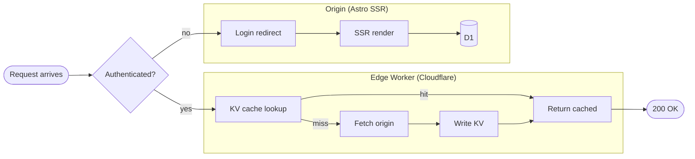
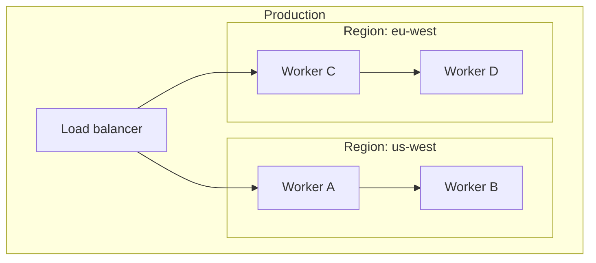
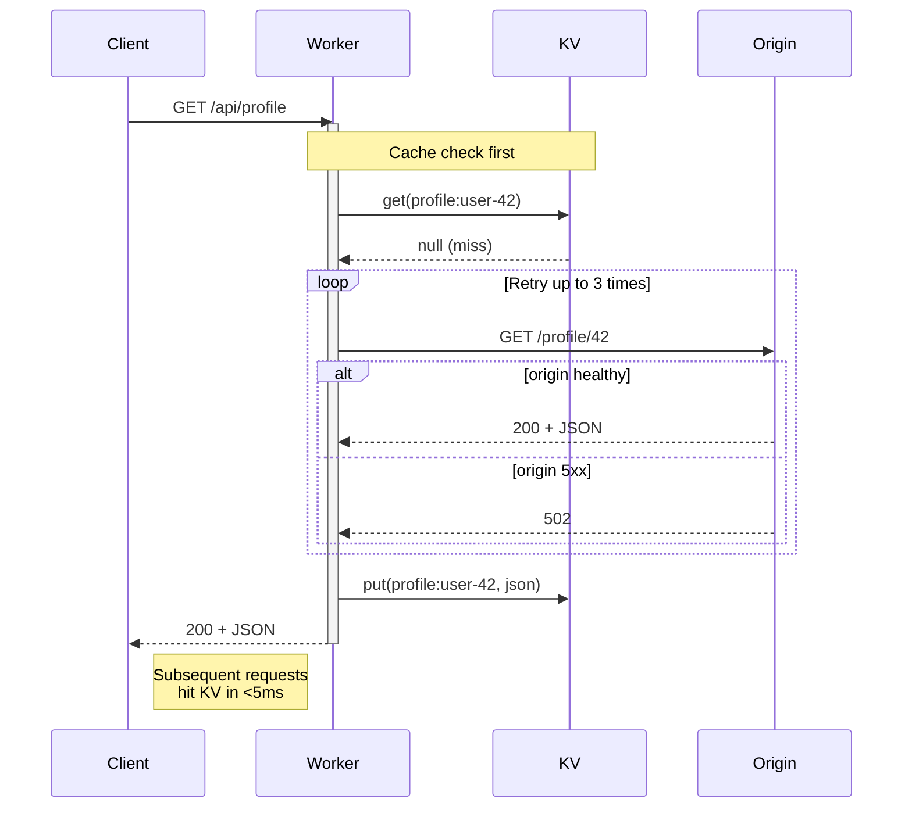
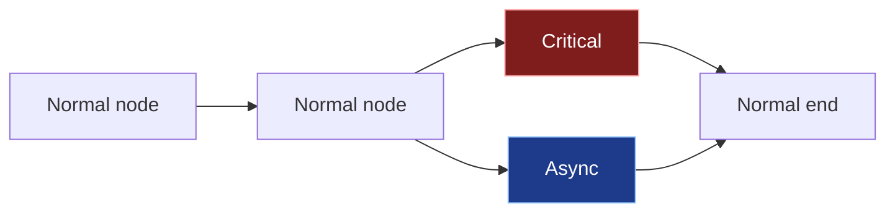
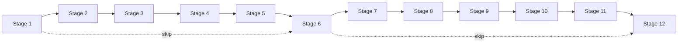
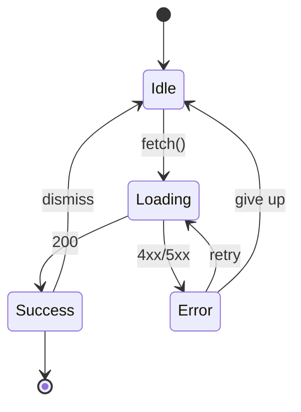

Internal QA page. Each diagram exercises a different code path that the
mermaid `<style>` strip + theme replacements need to handle. If anything
here renders with white blocks, washed-out fills, or unreadable labels in
either light or dark mode, the issue is upstream of any individual diagram
and the theme rules in `[slug].astro` need a follow-up.

## 1. Flowchart with two subgraphs

Standard subgraph layout — should render with `--muted/0.4` cluster
backgrounds and `--foreground` cluster labels, with all node + edge
styling matching the unified theme.

## 2. Nested subgraphs

Subgraph-inside-subgraph — checks that nested cluster backgrounds layer
correctly and don't cancel each other's tinting.

## 3. Sequence diagram with notes + loops

Sequence path uses different elements: `rect.actor`, `text.actor`,
`.messageText`, `.loopText`, `.noteText`, plus actor lifelines. Should
all read against both backgrounds.

## 4. classDef styling

Some posts use `classDef` to color-code specific nodes (e.g. critical-path
in red, async edges in blue). Verify our outer theme doesn't clobber the
custom `style:` declarations on these nodes — they should keep their
declared colors.

## 5. Wide flowchart (overflow scroll test)

Diagrams wider than the prose column should horizontal-scroll, not
shrink-fit. Edge labels along the path should remain readable as they
scroll past.

## 6. State diagram (different element set)

State diagrams use yet another element set (`state` shape, transition
arrows). Should still inherit the unified theme.

