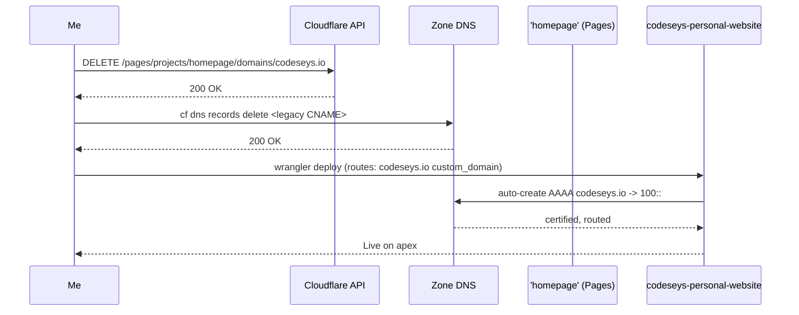
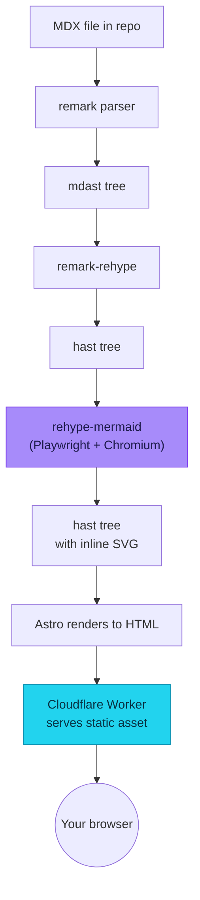

import { Image } from 'astro:assets'

I migrated the blog from Notion to repo-owned MDX last week. Today the next
piece landed: **diagrams render natively**. Drop a fenced ` ```mermaid ` block
in any post and Astro turns it into an inline SVG at build time — no client
JS, no FOUC, no extra hosting.

## The problem with text-only posts

Long technical posts hit a wall around the 2000-word mark. I have one on
implicit world models that's ~7000 words, all text. Every read feels like
homework. The solution isn't fewer words — most of those words are doing
work — it's that **a picture replaces three paragraphs and a reader's
willpower budget**.

Until now, getting an image into a blog post on this site was: open a
graphics tool → export a PNG → upload somewhere → embed by URL. Now it's
either drop a Mermaid block or commit a file next to the post.

## Mermaid: flowcharts, sequence diagrams, the works

Here's an apex cutover sequence — the actual cutover I did two days ago —
written as 12 lines of Mermaid:



And the pipeline that turned this very block into the SVG you're reading:



State machines, class diagrams, ER diagrams, gantt charts — all supported.
[Mermaid's docs](https://mermaid.js.org/intro/) cover the syntax.

## How it actually works

The neat trick: **Mermaid is browser-native** (it uses the DOM to measure
text), so rendering it server-side normally requires a headless browser.
That sounds gnarly until you realise our build already runs on a Linux VM
in GitHub Actions where Chromium is one `apt install` away.

`rehype-mermaid` v3 uses Playwright + Chromium under the hood. It walks
the rehype AST, finds every `<code class="language-mermaid">` node,
boots Chromium once for the whole build, renders each diagram, and
substitutes in the resulting SVG. The browser is process-pooled — 32
diagrams in one cold-start (≈5s), not 32 × 5s.

The Cloudflare Worker that serves you this page never touches any of
this. By the time the request hits the runtime, every SVG is already
inlined into the static HTML in `dist/`. **Zero JS on the client. Zero
runtime cost. Zero extra dependencies in the Worker bundle.**

## Theming

Diagrams use Mermaid's `neutral` theme so they read cleanly on both
light and dark backgrounds. (We can't follow the manual theme toggle
without client-side rendering, so we picked a neutral look that doesn't
need to.)

## Images: just drop them next to the post

For the kind of visualization Mermaid can't do — actual screenshots,
photos, charts from a real tool — colocate the image file in the same
folder as the post and reference it relatively:

```mdx
import { Image } from 'astro:assets'
import diagram from './arch.png'

<Image src={diagram} alt="Architecture diagram" />
```

Astro processes the file at build time: srcset, AVIF/WebP fallbacks,
correct width/height to prevent CLS, lazy loading. **The image lives in
git next to the prose** — version-controlled, branch-scoped, no
external CDN to coordinate with.

For Markdown posts (`.md`, no MDX), plain `` works
identically: same optimization, same path resolution.

## What about local development?

`rehype-mermaid` only spins up Playwright when it actually finds a
mermaid block, so posts without diagrams build at their normal speed.
First-time setup needs `bunx playwright install chromium` (~120MB download,
once); after that, cold builds add about 5s when diagrams are present
and warm builds are unchanged.

## Cost so far

- **Build time:** +5–10s on cold start when diagrams are present, 0 on
  hot rebuilds.
- **Bundle size:** unchanged. SVGs are inlined into HTML, but they
  compress well — typical mermaid SVG is 5-25KB pre-gzip.
- **Runtime:** Cloudflare Worker still hot-starts in ~20ms.
- **Extra deps:** just `rehype-mermaid` + `playwright` as dev deps.

The rabbit hole I avoided: trying to render mermaid at the Worker
runtime. Not possible — the Worker sandbox doesn't have a DOM,
Playwright doesn't run there, and shipping the full mermaid + dagre +
d3 client bundle (~700KB of JS) for one diagram per page would torch
TTI. Build-time is the right answer.

## What's next

Now I want to actually *use* this for the existing posts. The implicit
world models post has at least four implicit diagrams in its prose
that should become real ones. The Llama 4 SageMaker post has an
architecture section begging for a sequence diagram. Time to refactor.
